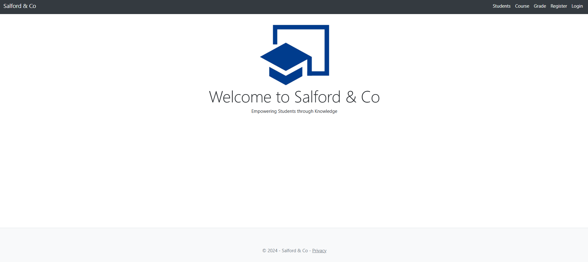
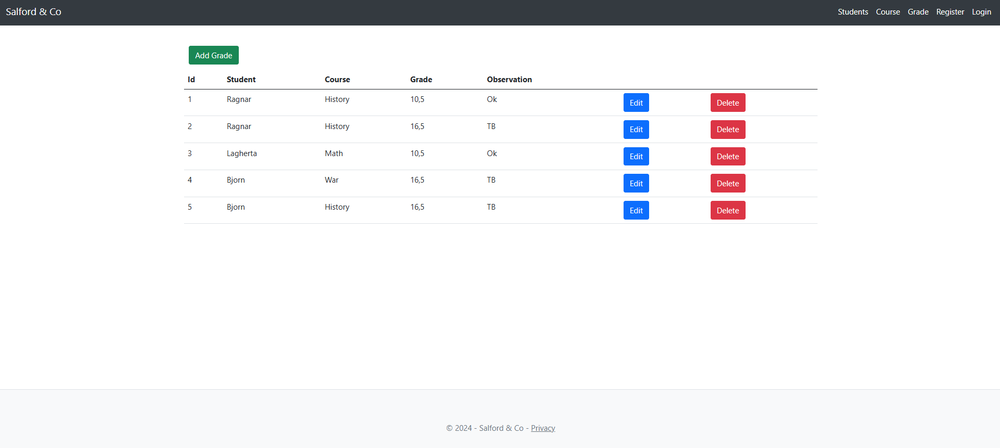
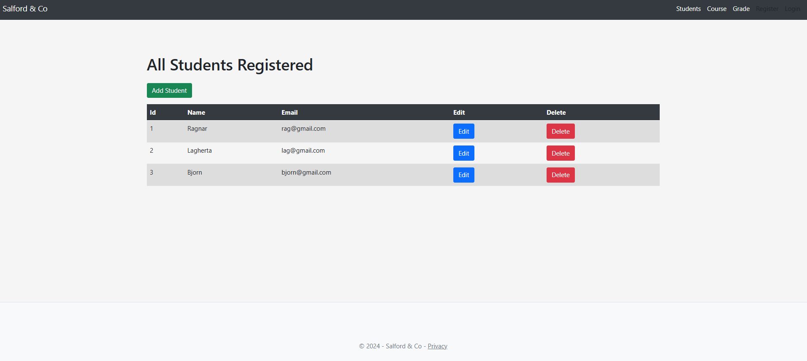

# 🎓 School Management Application

A professional **School Management Application** designed to streamline student tracking and enhance communication between **teachers, administrators, students, and parents**.  
The platform modernizes school administration by centralizing data, improving transparency, and fostering collaboration within the educational community.

---
## 🚀 Key Features

- 👨‍🎓 **Student Management**
  - Centralized student records
  - Personal, academic, and administrative information
  - Secure access based on user roles

- 🏫 **Attendance Monitoring**
  - Real-time attendance tracking
  - Historical attendance reports
  - Alerts for absences and lateness

- 📊 **Academic Performance Tracking**
  - Grades and evaluations
  - Progress monitoring
  - Performance analysis over time

- 💬 **Real-Time Communication**
  - Messaging between teachers, administrators, students, and parents
  - Improved collaboration and information sharing
  - Secure and role-based communication

- 🔐 **Authentication & Authorization**
  - Role-based access control (Admin, Teacher, Student, Parent)
  - Secure login using ASP.NET Identity

---

## 🛠️ Technologies Used

- **Backend**
  - ASP.NET Core
  - ASP.NET MVC / Web API
  - ASP.NET Identity

- **Database**
  - SQL Server
  - Entity Framework Core

- **Security**
  - Authentication & Authorization with Identity
  - Role and claims-based access control

---

## 🏗️ Architecture Overview

- Clean and scalable architecture
- Separation of concerns (Controllers, Services, Data Access)
- Secure user management with Identity
- Centralized database for consistency and reliability

---

## ⚙️ Getting Started

### Prerequisites

- .NET SDK (ASP.NET Core)
- SQL Server
- Visual Studio 

